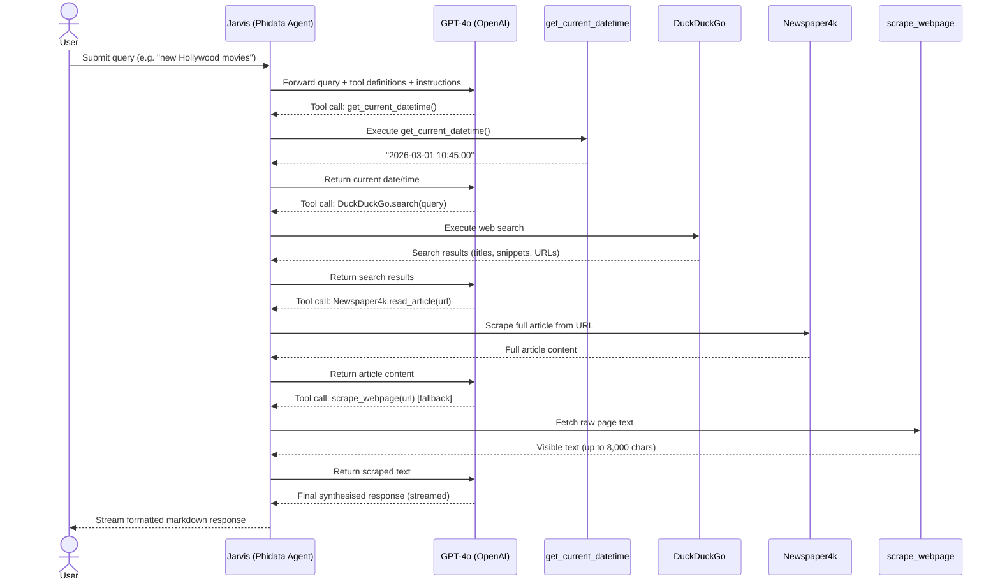

# Phidata Agent Demo

A collection of AI agent examples using [Phidata](https://www.phidata.com/) and OpenAI GPT-4o.

## Prerequisites

- Python 3.8+
- An OpenAI API key

## Setup

1. Install dependencies:
   ```bash
   pip install -r requirements.txt
   ```

2. Create a `.env` file with your API key:
   ```
   OPENAI_API_KEY=your_openai_api_key_here
   ```

> **Note:** `tmp/` (LanceDB vector store) and `.env` are excluded from git via `.gitignore`.

---

## Examples

### 1. `basic.py` — Simple conversational agent

A minimal agent named Jarvis that answers questions directly.

```bash
python basic.py
```

---

### 2. `agent_with_websearch.py` — Web search + scraping agent

Jarvis extended with three tools:

| Tool | Purpose |
|------|---------|
| `DuckDuckGo` | Search the web for snippets and URLs |
| `Newspaper4k` | Extract full article text from a URL |
| `scrape_webpage` | Custom scraper — fetches raw visible text from any HTTP/HTTPS URL using stdlib only |
| `get_current_datetime` | Returns the current date/time for time-sensitive queries |

```bash
python agent_with_websearch.py
```

#### Tool Interaction Sequence



---

### 3. `agent_with_kb.py` — Knowledge base (RAG) agent

Loads a local text file into a LanceDB vector store and answers questions using retrieval-augmented generation.

```bash
python agent_with_kb.py
```

**How it works:**
- Chunks `data/sample_article.txt` into 512-token pieces (64-token overlap)
- Embeds chunks using `text-embedding-3-small`
- Stores vectors in `tmp/lancedb/` (gitignored)
- Agent searches the KB before answering (`search_knowledge=True`)

> **Known compatibility issue:** `SearchType.hybrid` requires `pylance`, which conflicts with `lancedb 0.29.2`. Use `SearchType.vector` (the current default) to avoid this.

---

### 4. `agent_team.py` — Multi-agent team

A team of specialised agents coordinated by a Team Leader:

| Agent | Role | Tools |
|-------|------|-------|
| Jarvis (web agent) | Research & web search | DuckDuckGo |
| Financial Analyst | Market & stock analysis | YFinanceTools |
| Team Leader | Delegates tasks, synthesises answers | — |

```bash
python agent_team.py
```

---

### 5. `sqlite_agent.py` — SQL data analyst agent

An agent that queries a SQLite database (`data/sales_data.db`) and provides analytical insights. Supports two tool modes switchable at runtime:

| Mode | Tools | When to use |
|------|-------|-------------|
| Built-in (`use_custom_tools=False`) | `SQLTools` (Phidata built-in) | Simple queries |
| Custom (`use_custom_tools=True`) | `CustomSQLTools` from `tools.py` | Analytics with richer output |

```bash
python sqlite_agent.py
```

#### `CustomSQLTools` (tools.py)

A `Toolkit` subclass exposing five registered tools:

| Tool | Description |
|------|-------------|
| `execute_query` | Run any SQL query, returns results as a markdown table |
| `get_schema` | Inspect column names, types, and a sample value for a table |
| `get_sample_data` | Fetch the first N rows from a table |
| `get_column_stats` | Count / min / max / avg / sum for a numeric column |
| `search_data` | `LIKE` search across a column, returns up to 20 matching rows |

#### Database schema

The agent has access to a `sales` table:

| Column | Description |
|--------|-------------|
| `date` | Transaction date |
| `product` | Product name |
| `category` | Product category |
| `quantity` | Units sold |
| `unit_price` | Price per unit |
| `region` | Sales region |
| `salesperson` | Salesperson name |
| `customer_type` | Type of customer |
| `total_revenue` | Total revenue for the transaction |
| `month` | Month of the transaction |

---

## Files

| File | Description |
|------|-------------|
| `basic.py` | Minimal conversational agent |
| `agent_with_websearch.py` | Web search, scraping, and datetime tools |
| `agent_with_kb.py` | RAG agent with LanceDB knowledge base |
| `agent_team.py` | Multi-agent team with web + finance specialists |
| `sqlite_agent.py` | SQL analyst agent querying a SQLite sales database |
| `tools.py` | `CustomSQLTools` toolkit with schema, stats, and search tools |
| `data/sample_article.txt` | Sample article loaded into the knowledge base |
| `data/sales_data.db` | SQLite database used by the SQL agent |
| `requirements.txt` | Python dependencies |
| `.gitignore` | Excludes `tmp/` (LanceDB) and `.env` |

---

## Dependencies

| Package | Used by |
|---------|---------|
| `phidata` | All — agent framework |
| `openai` | All — GPT-4o LLM + embeddings |
| `python-dotenv` | All — load API keys from `.env` |
| `duckduckgo-search` | `agent_with_websearch.py`, `agent_team.py` |
| `newspaper4k` | `agent_with_websearch.py` |
| `yfinance` | `agent_team.py` |
| `lancedb` | `agent_with_kb.py` — vector store |
| `sqlalchemy` | `agent_with_kb.py` — lancedb dependency |
