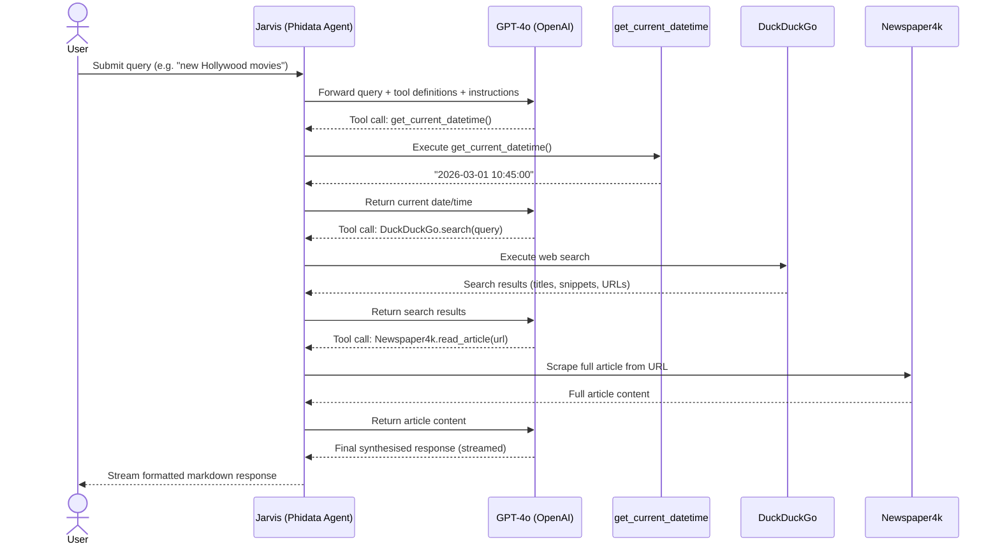

# Phidata Agent Demo

A basic example of building a conversational AI agent using [Phidata](https://www.phidata.com/) and OpenAI.

## Overview

This demo creates a simple agent named **Jarvis** powered by GPT-4o. It demonstrates the minimal setup required to get a Phidata agent running with streaming responses.

## Prerequisites

- Python 3.8+
- An OpenAI API key

## Setup

1. Install dependencies:
   ```bash
   pip install -r requirements.txt
   ```

2. Create a `.env` file in this directory with your API key:
   ```
   OPENAI_API_KEY=your_openai_api_key_here
   ```

## Usage

Run the basic agent:

```bash
python basic.py
```

This will invoke the agent with the prompt `"what is the value of Pi?"` and stream the response to the terminal.

## Web Search Agent — Tool Interaction

Sequence diagram showing how `agent_with_websearch.py` orchestrates tools and the LLM:



## Files

| File | Description |
|------|-------------|
| `basic.py` | Creates and runs a single conversational agent |
| `agent_with_websearch.py` | Agent with web search, scraping, and datetime tools |
| `requirements.txt` | Python dependencies |

## Dependencies

| Package | Purpose |
|---------|---------|
| `phidata` | Agent framework |
| `openai` | LLM backend (GPT-4o) |
| `python-dotenv` | Load API keys from `.env` |
| `duckduckgo-search` | Web search tool (available for extension) |
| `yfinance` | Financial data tool (available for extension) |
| `newspaper4k` | Article scraping tool (available for extension) |
| `lancedb` | Vector store for memory/RAG (available for extension) |
| `sqlalchemy` | Database support (available for extension) |
